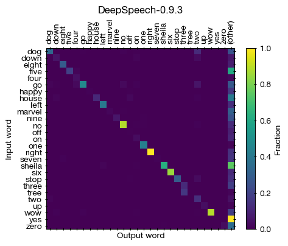
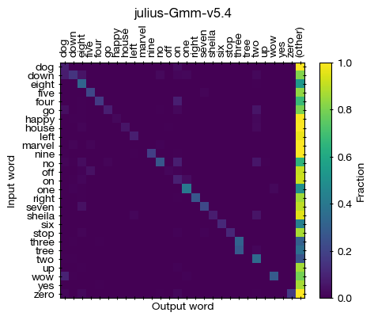
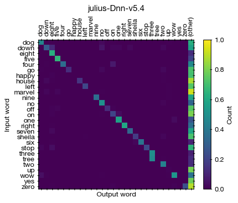

Evaluation of speech recognition software for commanding a computer
===================================================================

Lets say you want to command your computer with 10 simple words 
such as "up", "down", "stop", "six" that you assign
to scripts. You are willing to adapt the chosen commands
to make it easy for the computer.

**Can one take a automatic speech recognition (ASR) and
use it to command a computer?**

This project evaluates the correct recognition of 27 short spoken words,
with variations in speakers.

This is a somewhat realistic test, as the samples include background noise and speech variation.
Ideally, we would like a ASR that gives only one of the 27 words as answer
and skips the word if it is unsure, rather than recognise 
"ma mamma made my malamalama may a marmalade man not" 
when you say marvel 20 times.

Method
=============

Software selection
-------------------

1. Only Software that can be used offline is considered.
2. Only free and open-source software is considered.
   Wav2Letter++ has a dependency (flashlight) which requires non-open source build software (Intel MKL) and was therefore discarded.
3. The models should be reproducible from publicly available datasets, at least in principle.

Currently, this includes Project DeepSpeech and Julius (DNN and GMM variants). 
See at the bottom in the Todo section attempts with other software.

Help is very welcome! Please open a issue if you have suggestions 
how to make progress on other software or model variations.

Data selection
---------------

The `Synthetic Speech Commands dataset <https://www.kaggle.com/jbuchner/synthetic-speech-commands-dataset?select=augmented_dataset>`_
consists of 28 short words which have substantially different pronounciation.
It combines a variety of human speakers taken from publicly available datasets with 
utterances from text-to-speech (TTS) software run at various speed and pitch.
A variety of backgrounds are added.
This allows testing a wide variety of utterances on a small vocabulary.

The words are: dog down eight five four go happy house left marvel nine no off on one right seven sheila six stop three tree two up wow yes zero

To get audio examples, download the dataset (wav files in the augmented_dataset/ folder).

Evaluation
-----------

The same word (e.g., yes) in different utterances is passed to the ASR as a 10-20min file.

* The number of input utterances is counted (relevant elements).
* The number of times the word is recognized correctly (as yes or a homophone) is counted (true positives).
* The number of times another word from the word list is recognized is counted (false positives, within vocabulary).
* The number of times a completely different word is recognized is counted (false positive, outside vocabulary)

A confusion matrix is then created.

See the run.sh and evaluate.py scripts for details.

Speed is not evaluated.

Results
==============

**Confusion matrix for DeepSpeech-0.9.3**

Input is in rows, output is in columns.

* For the majority of words, the recall is extremely low (below 20%).
* Some words are consistently not recognized (wow, sheila), and probably outside the training set.
* Some words seem to have high recall (no, right, yes). Testing these on short microphone recordings does not reproduce the recall.
* The recognized words are sometimes quite complex and amusing (see output below).

**Confusion matrix for julius-Gmm-v5.4**

* GMM are a bit older technology commonly used before neural networks, so it is interesting to know what these models produce(d).
* For all words, the recall is extremely low (below 50%).
* The recognized words are mostly outside the vocabulary, and unrelated (not homophones).
* This is clearly not usable.

**Confusion matrix for julius-Dnn-v5.4**

* For the majority of words, there is recall (most above 30%, half above 50%).
* Some words are consistently not recognized (happy, marvel, up).
* tree is consistently misrecognized as three. It is probably a good idea to remove "tree" as a command.
* The recognized words are sometimes quite complex and amusing (see output below).

Evaluation results, with the true and false in-vocabulary positives are listed below as a table,
as well as 10 examples for out-of-vocabulary recognitions by descending frequency.
The nsamples.json file contains how many input utterances there are per word (typically ~1000).

Evaluation output::

	$ python evaluate.py 
		  word	# true	# false	          ASR system	other words
		   dog	  225	   20	    DeepSpeech-0.9.3	253 (to that not so a but or good london had)
		   dog	  306	   21	     julius-Dnn-v5.4	432 (the a auld org daughter don't la dalton built not)
		   dog	   56	   27	     julius-Gmm-v5.4	733 (always as dawlish the that blogs but golf said answer)

		  down	   25	   17	    DeepSpeech-0.9.3	98 (to town and o now how ototototoi noonoon a downtown)
		  down	   92	   94	     julius-Dnn-v5.4	757 (town it does the home now tally italian telly saudi)
		  down	   11	  125	     julius-Gmm-v5.4	858 (dolly it the allen alley now this how did saudi)

		 eight	   81	    1	    DeepSpeech-0.9.3	186 (it at and tightened ah a had did auntie initiation)
		 eight	  436	    0	     julius-Dnn-v5.4	114 (it said the names panesar de bates they hasan he)
		 eight	  222	    2	     julius-Gmm-v5.4	398 (said gates plates the they bids bates it's it planes)

		  five	  153	   14	    DeepSpeech-0.9.3	482 (i o far i'm in you or l fortifie farthings)
		  five	  522	    0	     julius-Dnn-v5.4	163 (size always scientists as sawyer ties sizing the folly desire)
		  five	  168	   17	     julius-Gmm-v5.4	663 (scalia salim as always said filings spies you his colleagues)

		  four	   74	    2	    DeepSpeech-0.9.3	42 (or a roorootoo amarapoora orontobates moorooroo horrorstricken aloofness o aforementioned)
		  four	  600	  142	     julius-Dnn-v5.4	914 (so oh source fold fog la what farm i thought)
		  four	  146	  164	     julius-Gmm-v5.4	1415 (salt fold scores us source oh so as boy always)

			go	  335	   53	    DeepSpeech-0.9.3	239 (or to so door more law our slow you now)
			go	   93	   31	     julius-Dnn-v5.4	512 (jo the la girl cole ma moon poor goal co)
			go	   59	   76	     julius-Gmm-v5.4	585 (the co moore jo so la year lol world move)

		 happy	    8	    7	    DeepSpeech-0.9.3	162 (the that he tatatatatat fate teetotallers apathetically said hat but)
		 happy	    3	   15	     julius-Dnn-v5.4	697 (t. thirty the day a v. p. de thirteen heat)
		 happy	   22	    4	     julius-Gmm-v5.4	1006 (the a c. deal seed day that heat complete to)

		 house	  187	   45	    DeepSpeech-0.9.3	692 (as o a out oath our his is how hot)
		 house	  245	   12	     julius-Dnn-v5.4	1442 (said the coast polls does clausen klaus hours holmes values)
		 house	   92	   46	     julius-Gmm-v5.4	1717 (clouds values said was there as those his are the)

		  left	  361	    6	    DeepSpeech-0.9.3	117 (look little like i lilliebelle lip leetle illimitable liveliest lookeedesee)
		  left	  191	    2	     julius-Dnn-v5.4	662 (last leicester year lace blessed blaze the leinster police said)
		  left	   74	    6	     julius-Gmm-v5.4	872 (lessons the lists let's see let analysts said leicester lives)

		marvel	   15	    5	    DeepSpeech-0.9.3	252 (ma mamma made my malamalama may a marmalade man not)
		marvel	    0	   21	     julius-Dnn-v5.4	768 (mozat map mozza miles monsey ma mazza melt badly last)
		marvel	    0	   26	     julius-Gmm-v5.4	928 (mazda last year mind melt said map monzel miles my)

		  nine	   47	    8	    DeepSpeech-0.9.3	192 (i in you are non initiation nineteenth colonialism initiating and)
		  nine	  280	    1	     julius-Dnn-v5.4	457 (hi iron the are you lawyer island noisy hyun higher)
		  nine	  141	   10	     julius-Gmm-v5.4	843 (the alley high new orleans allianz noon wseq1: <s> knowing)

			no	  603	    7	    DeepSpeech-0.9.3	93 (or and the to your i her you oroonoko orator)
			no	  345	    1	     julius-Dnn-v5.4	230 (la low oh lol the nuke though old had home)
			no	  183	   78	     julius-Gmm-v5.4	514 (the though old and in it move lol oh this)

		   off	    7	    3	    DeepSpeech-0.9.3	139 (o oh or anooroudha orthognathous notoriously both opportunities and after)
		   off	  190	   43	     julius-Dnn-v5.4	1165 (also both polls oh path the paulson bonus us balls)
		   off	   26	   93	     julius-Gmm-v5.4	1436 (polls balls calls also alston both the paulson parts said)

			on	   50	    1	    DeepSpeech-0.9.3	158 (and i ananda unannounced announcement an am announced annunciation torontonians)
			on	  295	   58	     julius-Dnn-v5.4	1176 (earlier in and the are you oh valley that allen)
			on	  125	   60	     julius-Gmm-v5.4	1383 (and that is polly valley this folly burley london in)

		   one	  390	    3	    DeepSpeech-0.9.3	16 (while nonnenmattweiher woinomoinen well eleonora and he beninobenone nineteen onwanonsyshon)
		   one	  513	    1	     julius-Dnn-v5.4	259 (wall-e worley well nuke walton you were lamb the had)
		   one	  361	    1	     julius-Gmm-v5.4	483 (wall-e worley london well why wallace in the tale what)

		 right	  868	    1	    DeepSpeech-0.9.3	121 (cried roy red road royal it or i light orright)
		 right	  496	   10	     julius-Dnn-v5.4	302 (brides ride lloyds the lights royds brighton flights bright like)
		 right	  222	    7	     julius-Gmm-v5.4	721 (lights the paulites brides lloyds polite said ride rollins bullets)

		 seven	    8	    1	    DeepSpeech-0.9.3	139 (and seventeen said it saved i aneantissement a aniseseed sanded)
		 seven	  293	    0	     julius-Dnn-v5.4	538 (save sadly salesmen them sampson sandlin it hansen sanlu samson)
		 seven	  188	    5	     julius-Gmm-v5.4	823 (stay standard said it standing save sunday did sandy a)

		sheila	    6	   20	    DeepSpeech-0.9.3	1343 (she laughed loved looked wore walked learned lose love led)
		sheila	   63	    6	     julius-Dnn-v5.4	820 (la she learn ielec loved laughed lamb to the eleven)
		sheila	    6	   19	     julius-Gmm-v5.4	1057 (learn eleven she you c he to love la laughed)

		   six	  637	    2	    DeepSpeech-0.9.3	206 (seek see seeks said sir seats i possesses she set)
		   six	  281	    3	     julius-Dnn-v5.4	159 (sikhs said seeds she saves savers c s foods sunday)
		   six	   59	    0	     julius-Gmm-v5.4	422 (states stakes seeds said status state stevens sen speaks this)

		  stop	  283	    7	    DeepSpeech-0.9.3	163 (to tump tom a tomato tumpitum ototototoi jump stump tomatoes)
		  stop	  211	   21	     julius-Dnn-v5.4	668 (stalled start it sort talks started jump starter salt salter)
		  stop	   36	   22	     julius-Gmm-v5.4	927 (source salt stoke stalled stalls stokes still so stump as)

		 three	  106	    0	    DeepSpeech-0.9.3	165 (free the retreated referee breathe be and reenthronement ehrenbreitstein but)
		 three	  447	    1	     julius-Dnn-v5.4	81 (reid lever the civil sully other cleaver had slade nuke)
		 three	  283	    5	     julius-Gmm-v5.4	283 (we the selena screen greene saline suleiman are salina serena)

		  tree	    0	  139	    DeepSpeech-0.9.3	12 (retreated etherealised terrestrial ethereal eternities three dog down eight five)
		  tree	    0	  406	     julius-Dnn-v5.4	113 (me lever reid re to the arena ahead selena sorry)
		  tree	    0	  238	     julius-Gmm-v5.4	331 (selena we surrey sweet are to terry salina screen suleiman)

		   two	    4	    9	    DeepSpeech-0.9.3	108 (to ototototoi the torture totopotomoy tottenham child petitioners antidote tooth)
		   two	  259	    3	     julius-Dnn-v5.4	98 (though so the sooner civil tale soon co said too)
		   two	  215	    7	     julius-Gmm-v5.4	168 (sooner soooo soon year so this silva last he sen)

			up	   27	    0	    DeepSpeech-0.9.3	15 (uh a ouaouaoua uluhoomoe mahoudeau bulamutumumo oh upaupahuras homoeopathist to)
			up	    6	    5	     julius-Dnn-v5.4	640 (oh earlier the earth booked but a gov org both)
			up	    0	   14	     julius-Gmm-v5.4	705 (oh books co box the oats but said polls boats)

		   wow	   36	   13	    DeepSpeech-0.9.3	735 (well we will you how were are who ooroowela to)
		   wow	   56	   34	     julius-Dnn-v5.4	590 (well loan while why where the loud lamb had nuke)
		   wow	    2	   84	     julius-Gmm-v5.4	768 (well the world where lol loud while why wild you)

		   yes	 1052	    0	    DeepSpeech-0.9.3	193 (you asked ask as he i is us see this)
		   yes	  550	    2	     julius-Dnn-v5.4	65 (sir years son as the hayes said soon blues he)
		   yes	  431	    8	     julius-Gmm-v5.4	250 (yates years this year said is there he sir time)

		  zero	   24	    2	    DeepSpeech-0.9.3	339 (a in more row the he arose said senor there)
		  zero	  225	   13	     julius-Dnn-v5.4	841 (the road law la a rule row goal hello their)
		  zero	  162	   55	     julius-Gmm-v5.4	1055 (the road a role goal row rail in it they)

Conclusion
============

The answer is no.

The best setup tested is Julius with the Dnn-v5.4 model, with an average recall near or below 50%.

Probably one can improve the results by giving the vocabulary to the system (see below),
but I have not succeeded.

The limited instructions in most projects on how to use downloadable models were a hurdle,
which limited the number of systems I could test, so your favorite project may not be included.

Todo
============

Contributions and submissions of evaluations are very welcome!

* Julius with grammar:

  * It should be possible to create a grammar that could improve results (see below)
  * But I am getting an error that no pause model / pause word was defined.

* Kaldi: 

  * I was able to fetch models and build/install; unclear how to use (not ready-to-use, but a ASR build kit?)

* PaddlePaddle/DeepSpeech2: 

  * I was able to fetch models and build/install; unclear how to use (not ready-to-use, but a ASR build kit?)

* Athena: 

  * I was able to build/install; could not figure out how to run inference with downloaded model. Do I have to point "pretrained_model" in the config to the file?

* MyCroft: seems to be mostly a interface to other software, and uses Google assistant remotely by default. It was therefore not included.

* Wav2Letter++: Perhaps someone could patch flashlight to allow building with another compiler.

Not looked at yet
------------------

* OpenSeq2Seq
* Fairseq
* Vosk
* ESPnet

Custom systems
------------------

To succeed here, a classifier that takes 2 second audio and
assignes it to one of 28 categories could suffice.
Combining audio features with random forests, `I was not successful with this though <https://github.com/JohannesBuchner/spoken-command-recognition/>`_.

Takeaway: Speech is hard, and the people working on this have my respect.
